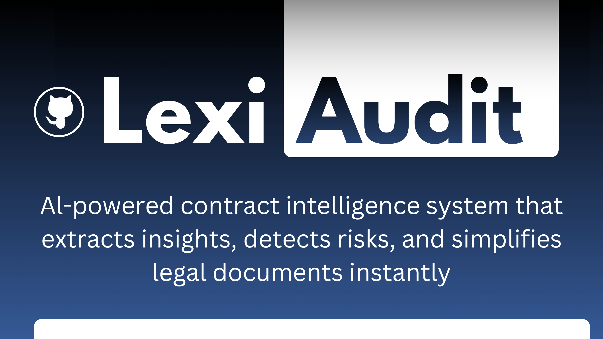

  

 

#  LexiAudit: AI-Powered Contract Intelligence System

LexiAudit is a full-stack AI system that analyzes legal contracts and extracts structured insights such as parties, contract type, and risk factors. It combines rule-based logic, semantic retrieval, and lightweight NLP to deliver fast, interpretable results.

 Live Demo: https://lexi-audit.vercel.app/  

---

##  Features

-  **PDF Contract Analysis** (multi-page support)
-  **Layout-Aware Parsing** (detects clauses & sections)
-  **Semantic Chunking** for retrieval optimization
-  **Entity Extraction (NER)**
  - Organizations
  - Individuals
  - Dates
-  **Contract Classification**
  - NDA, Employment, Acquisition, etc.
-  **Risk Detection Engine**
  - Unlimited liability
  - Termination without notice
  - Broad indemnification
  - Ambiguous clauses
-  **Vector Search (RAG Backbone)** using ChromaDB
-  **Processing Pipeline Visualization**
-  **Metrics Panel**
-  **Demo Dataset Mode**
-  Fully **mobile-responsive UI**

---

##  Architecture
PDF → Text Extraction → Layout Parsing → Chunking → Embeddings → Vector DB
→ Entity Extraction → Classification → Risk Detection → Output

---

## 🧠 Tech Stack

### Frontend
- Next.js (App Router)
- Tailwind CSS
- TypeScript

### Backend
- FastAPI
- pdfplumber
- sentence-transformers
- ChromaDB
- python-multipart

### AI / NLP
- Rule-based anomaly detection
- Lightweight NER
- Semantic similarity retrieval

---

## ⚙️ How It Works

1. Upload a legal contract (PDF)
2. Extract text using PDF parsing
3. Identify sections using layout-aware heuristics
4. Chunk text for semantic processing
5. Store embeddings in vector database (ChromaDB)
6. Extract entities (parties, dates, organizations)
7. Classify contract type
8. Detect risk patterns
9. Display structured insights in UI

---

##  Demo Mode

Click:

 **Load Demo Dataset (Pre-analyzed Contract)**

This loads:
- Realistic company entities
- Multiple legal risks
- Structured output

No file upload required.

---

##  Notes

- Backend is hosted on Render (may take ~20–40s on first request due to cold start)
- CORS is enabled for public access
- Designed for interpretability and fast analysis

---
